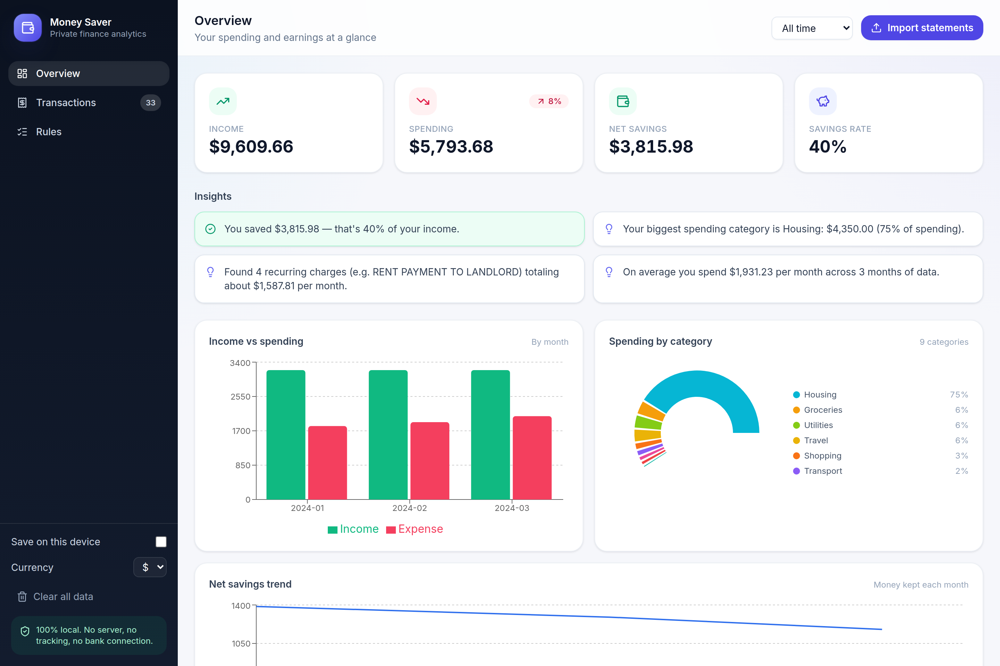
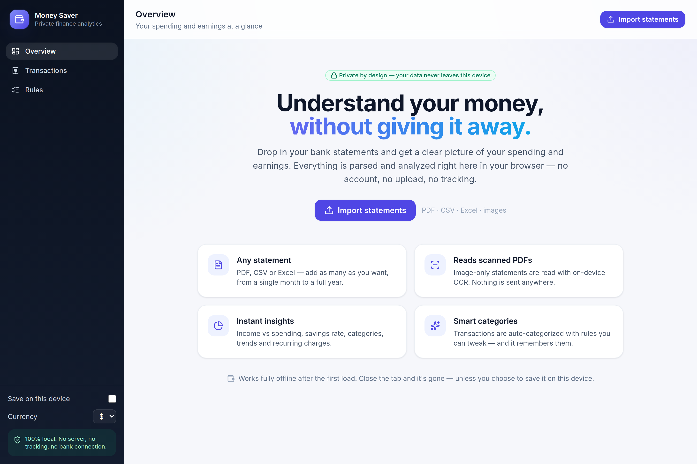
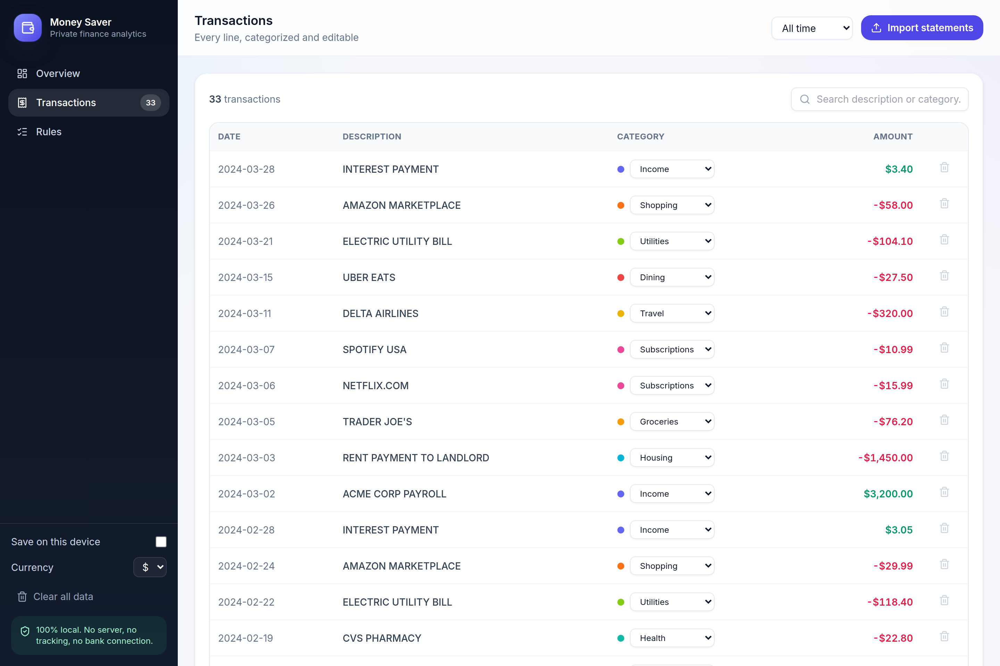

# 💰 Money Saver

[](https://github.com/saikiran7022/Money-saver/actions/workflows/deploy.yml)

> Live site: **https://saikiran7022.github.io/Money-saver/** (after the first deploy)

A **privacy-first** money analysis app. Drop in your own bank statements and get a clear
picture of your spending and earnings — **entirely in your browser**. There is no server,
no account, no tracking, and no bank connection. Your financial data never leaves your
device.



<details>
<summary>More screenshots</summary>

**Landing**


**Transactions**


</details>

## Why it's private

- **Nothing is uploaded.** Every statement is parsed and analyzed locally in your browser.
- **No backend, no logs, no analytics.** The app is just static files.
- **The app can't phone home.** A strict `Content-Security-Policy` (`connect-src` limited
  to the app's own origin) blocks all external network requests at runtime.
- **Storage is opt-in.** By default everything lives in memory and is gone on refresh.
  Tick **“Save on this device”** to keep data in your browser’s IndexedDB (and nowhere
  else). **“Clear all data”** wipes it instantly.

## Features

- **Add as many statements as you like**, covering any range from monthly to yearly.
  Overlapping statements are de-duplicated so nothing is double-counted.
- **Multiple formats:**
  - **PDF** (primary) — text-based statements are read directly; **scanned / image-only**
    pages are read with **in-browser OCR** (see below).
  - **Images** (PNG/JPG photos or scans) via OCR.
  - **CSV / Excel** — the most reliable path when your bank offers an export; columns are
    auto-detected.
- **Review step.** Parsed rows are always shown for you to correct (date, description,
  amount, category) or add/remove before they’re counted.
- **Automatic categorization** with editable rules. Re-categorize any transaction; save the
  choice as a rule (“contains *spotify* → Subscriptions”) that applies everywhere and is
  remembered locally.
- **Analysis & insights:** income vs. spending, net savings & savings rate, spending by
  category, monthly trends, top merchants, recurring/subscription detection, and
  plain-language insights (e.g. “Spending rose 18% vs last month”).
- **Period filter:** all-time, by year, or by month.

## Quick start

```bash
npm install
npm run dev      # open the printed localhost URL
```

Build a static, deployable site:

```bash
npm run build    # outputs ./dist — host it on any static host (e.g. GitHub Pages)
npm run preview  # preview the production build locally
```

Run the tests:

```bash
npm run test
```

## Enabling OCR (optional, for scanned PDFs & images)

OCR runs **fully offline** using [tesseract.js](https://github.com/naptha/tesseract.js)
(WebAssembly). To keep the zero-egress guarantee, the OCR engine and English language data
are served from the app’s own origin. Install them once:

```bash
npm run setup:ocr
```

This copies the tesseract worker + wasm core out of `node_modules` and downloads the
English language data into `public/vendor/tesseract/`. That single download is an explicit,
one-time **build** step — the app itself never connects to the internet. After it runs,
tick **“OCR scanned pages”** in the upload panel. Text-based PDFs and CSV/Excel imports
work without this step.

## How parsing works

Bank statement layouts vary wildly, so the PDF/image path is heuristic + human-in-the-loop:

1. Text is extracted (pdf.js text layer, or OCR for scanned pages) and grouped into lines.
2. Each line is scanned for a leading **date** and money-like **amount(s)**.
3. Direction (money in vs. out) is inferred from a running-balance column when present,
   then from explicit signs / CR-DR markers, then from income-like wording, defaulting to
   an expense otherwise.
4. Everything is shown in the **review table** for you to confirm or fix.

CSV/Excel is the most reliable importer: column mapping is auto-detected from the header
row (date / description / amount, or a debit + credit pair).

## Tech

Vite · React · TypeScript · Tailwind · Zustand · Recharts · pdf.js · tesseract.js ·
PapaParse · SheetJS · idb. 100% client-side.

## License

Apache-2.0 — see [LICENSE](./LICENSE).
